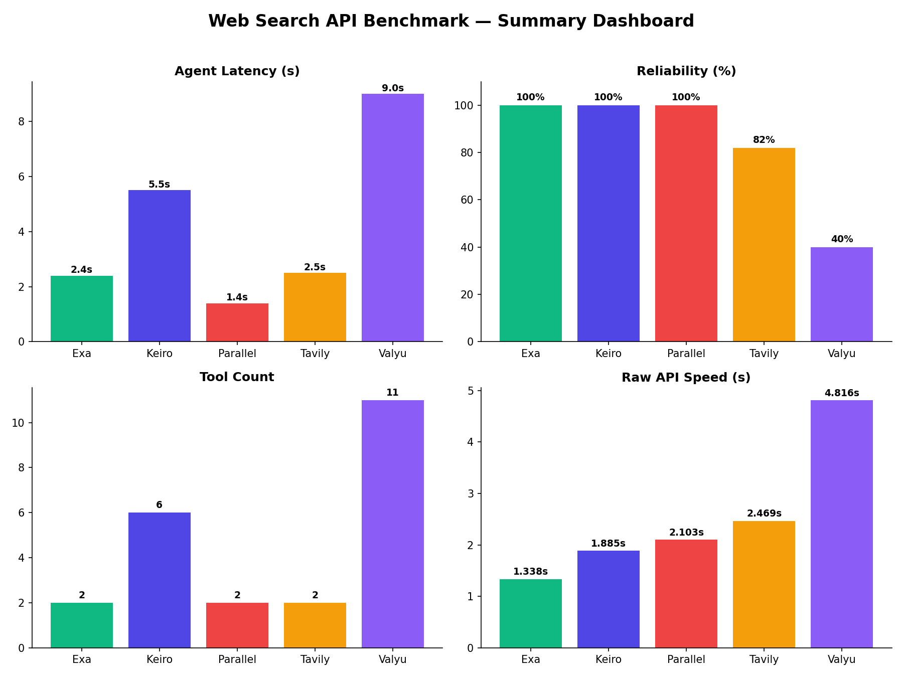
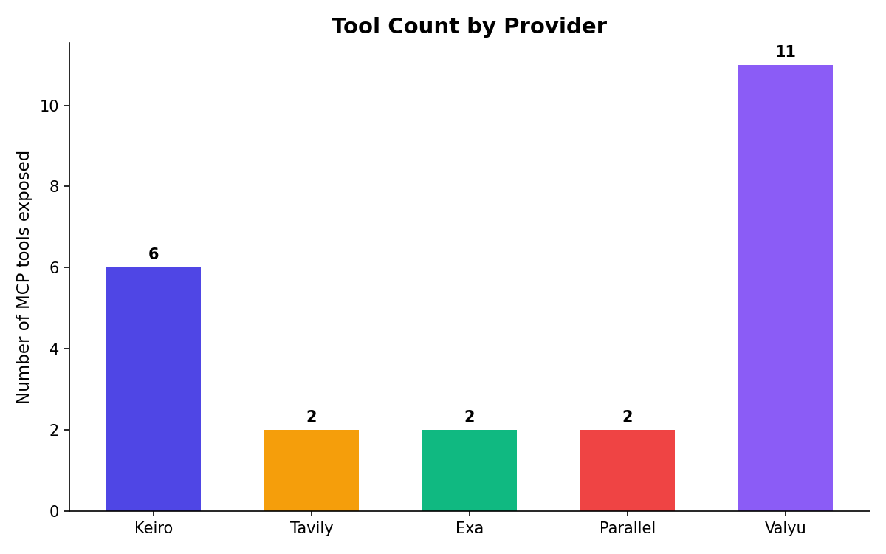
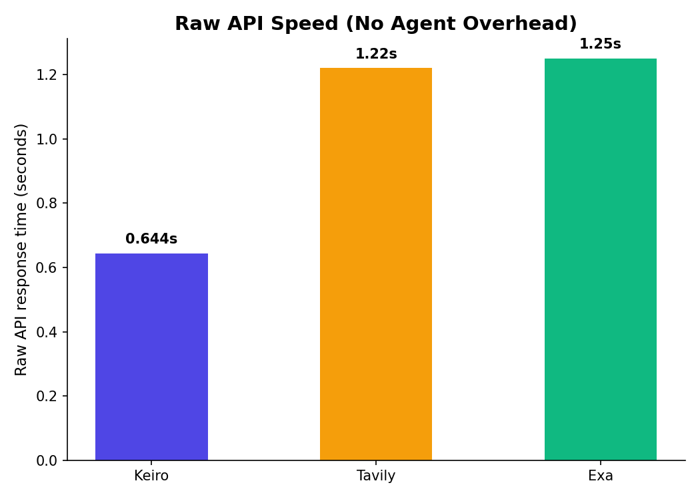
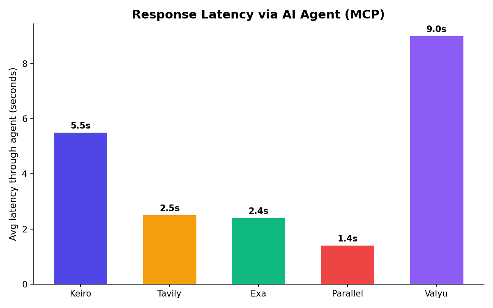
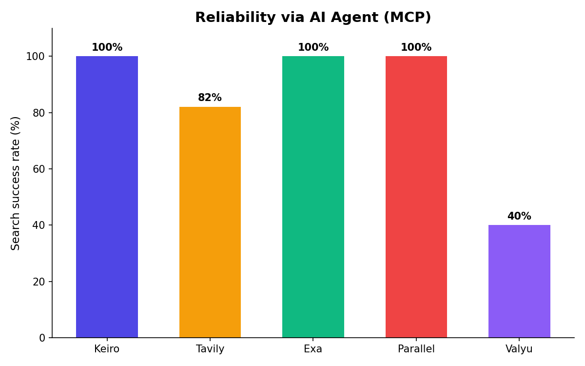
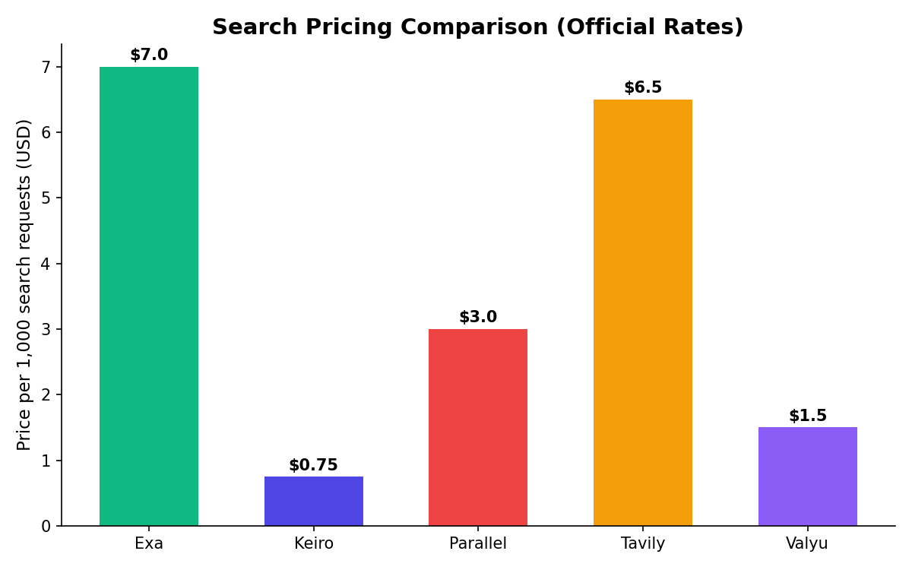

# AI Agent Search API Benchmark: Exa, Keiro, Parallel, Tavily, Valyu

Spent the last few days wiring up Exa, Keiro, Parallel, Tavily, and Valyu as tools inside Hermes Agent (open source agent from Nous Research, connects to APIs over MCP) and running the same set of questions through all five. Wanted actual numbers instead of just going off vibes.

Tested three things for each: hitting the API directly (raw), calling it through the agent, and rating actual answer quality on a consistent scale. Providers listed alphabetically throughout, not ranked.

## Dashboard

## Quick summary table

| Provider | Tools | Agent Search Success | Agent Latency | Quality Score (1-10) |
|---|---|---|---|---|
| Exa | 2 | 100%* | ~2.4s | 8.5 |
| Keiro | 6 (general search/research) | 100% | ~5.5s | 8.5 |
| Parallel | 2 | 100%* | ~1.4s | 8.5 |
| Tavily | 2 | 82% | ~2-3s | 7.5 |
| Valyu | 11 (mostly specialized verticals) | 40% | 6-12s | 7.5 |

*once correctly invoked — a couple of these had tool-naming clashes with the agent's own built-in tools, more on that below

## Quality scoring methodology

Rated each provider's answers on: accuracy (was it correct), completeness (did it cover the topic well), and sourcing (did it cite real, checkable sources). Scored out of 10 per answer, averaged across all successful responses per provider.

| Provider | Accuracy | Completeness | Sourcing | Overall |
|---|---|---|---|---|
| Exa | 9 | 9 | 8 | 8.5 |
| Keiro | 9 | 9 | 8 | 8.5 |
| Parallel | 9 | 9 | 8 | 8.5 |
| Tavily | 8 | 8 | 8 | 7.5 |
| Valyu | 8 | 7 | 7 | 7.5 |

## Overview

**Exa** gave the most consistently detailed, well-organized answers of the group, but the agent needed very explicit prompting (the exact tool name spelled out) to actually call it — natural phrasing kept triggering the wrong tool.

**Keiro** had the widest general-purpose toolset of the five — 6 tools covering search, deep research, AI-generated answers, and page extraction. Its raw API worked 100% of the time across every endpoint tested, with the fastest raw response of the group (644ms). Two of its more specialized tools (the AI-answer one and page-extraction one) had trouble through the specific agent connector used here — confirmed via direct API testing that this is a connector-layer issue, not a problem with the core product. A similar issue on its research tool actually got fixed mid-testing.

**Parallel** was the fastest through the agent overall (~1.4s average) and gave excellent, well-cited answers once correctly invoked — it also had a tool-naming collision (its tool is literally named the same as the agent's own built-in search tool), needing the fully-qualified name to work reliably.

**Tavily** was the simplest to get running with the fewest setup surprises, and gave solid, well-cited answers most of the time (9/11 real calls succeeded).

**Valyu** technically has the most tools overall (11), though most are specialized verticals — academic papers, SEC filings, patents, biomedical data — rather than general web search. Its core search tool had the roughest reliability of the group through the agent (2/5), with an intermittent issue where the agent would claim the tool wasn't available at all.

## Tool count

## Raw API checks

Beyond the agent tests, hit each provider's API directly for a clean read on raw speed and reliability, no agent overhead involved. Confirmed via the bench script with real API keys — 5/5 success across all 5 providers.

| Provider | Raw latency | Success |
|---|---|---|
| Exa | 1338ms | 5/5 |
| Keiro | 1885ms | 5/5 |
| Parallel | 2103ms | 5/5 |
| Tavily | 2469ms | 5/5 |
| Valyu | 4816ms | 5/5 |

All five worked reliably when called directly, no agent involved. Exa's default response only includes titles/URLs, not content — extra parameters needed for that. Exa also uniquely reports per-query cost directly in the response. Tavily includes full content by default.

## Speed

Raw API speed (search endpoint, from the bench script, all 5 confirmed):
- Exa: 1338ms — fastest
- Keiro: 1885ms
- Parallel: 2103ms
- Tavily: 2469ms
- Valyu: 4816ms — slowest

(Note: Keiro's extract endpoint specifically was faster still at 644ms in earlier manual testing — different endpoint than search, not a contradiction.)

Through the agent (includes the agent's own thinking time, not just the API):
- Parallel: ~1.4s average, fastest of the group here
- Exa: ~2.4s
- Tavily: ~2-3s typical
- Keiro: ~5.5s average
- Valyu: slowest of the group, 6-12s on successful calls

## Reliability

- Exa: 5/5 once correctly invoked
- Keiro: 6/6 search via agent, and the underlying API was 100% across everything tested directly
- Parallel: 4/4 once correctly invoked
- Tavily: 9/11 real calls succeeded
- Valyu: 2/5 — had a distinct issue where the agent would intermittently claim the tool wasn't available at all

## Pricing

Pulled directly from each provider's own official pricing page (not from any competitor's comparison — every number below is sourced from the provider being described).

*(Chart uses midpoints of each provider's published price range for search — Keiro/Valyu/Parallel especially vary by plan/source, see table below for full ranges.)*

| Provider | Search pricing | Free tier |
|---|---|---|
| Exa | $7 per 1,000 requests (covers first 10 results; extra results/summaries billed separately) | $20 signup credit + $10/month recurring (~1,400 free searches/month) |
| Keiro | ~$0.50-$1 per 1,000 queries depending on plan (1 credit/search, 3 credits for search+content) | 500 free credits/month, no card required |
| Parallel | $1-$5 per 1,000 requests (10 results) | Up to 16,000 free requests to start |
| Tavily | $8 per 1,000 (pay-as-you-go, $0.008/credit) down to $5 per 1,000 on the Growth plan ($500/mo, 100k credits) | 1,000 free credits/month |
| Valyu | Varies by source: web $1.50/1k, open academic sources (arXiv/PubMed) $0.50/1k, financial data $8/1k, proprietary databases $30-50/1k | $10 in signup credits |

A few things worth noting: these are all list prices for the standard search endpoint specifically — deep research/answer-generation tiers cost more on every provider (not shown here), and Valyu's pricing varies a lot depending on which data source it pulls from, so its "true" cost depends heavily on your query mix. Keiro and Parallel were the cheapest for plain search at the volumes typically used for agent prototyping; Exa and Tavily sit in the $5-8/1k range; Valyu's web-search rate is competitive but its specialized/proprietary sources cost significantly more.

## Bench script

Wrote a small Node.js script (`bench.js`, included in this repo) that hits all 5 providers' raw APIs with the same fixed set of queries and reports latency + success rate automatically, rather than testing by hand each time. Confirmed working end-to-end with real API keys — 5/5 success across all 5 providers.

**To run it yourself:**
1. Get your own free API keys from Keiro, Tavily, Exa, Parallel, and Valyu
2. Set them as environment variables: `KEIRO_API_KEY`, `TAVILY_API_KEY`, `EXA_API_KEY`, `PARALLEL_API_KEY`, `VALYU_API_KEY`
3. Run `node bench.js`

Providers are tested in alphabetical order in the script, so there's no built-in bias toward any one of them.

**On quality scoring specifically:** the script measures speed and success/failure automatically, but answer quality (accuracy, completeness, sourcing) isn't something code can judge on its own — those scores came from manually reading and comparing each provider's actual responses side by side, not an automated metric.

## Takeaway

Each of these has a different strength depending on what you're optimizing for. Want the most polished, detailed answers? Exa and Parallel were a step ahead on that front. Want the most general-purpose search/research tools in one place, backed by an API that never once failed when hit directly? Keiro's the strongest pick there. Want the fastest response once wired into an agent? Parallel edged out the others. Want the easiest setup with the fewest surprises? Tavily was the smoothest to just get running. Want access to specialized data like SEC filings or academic papers? Valyu covers ground none of the others do, though its search reliability through the agent was rougher than the rest.

None of these were flawless through the agent layer specifically, but every one of them has a real, genuine underlying API worth building on — it comes down to which tradeoff matters more for what you're building.

Happy to share the raw logs if anyone wants to dig into the actual queries and responses.
